# 07 — Project Architecture

This is the single diagram of record for CoachOS. Every box below traces back to a decision made in docs 01–06 — nothing here is new; this is those decisions drawn as one system. To request a change, point at a labeled box or a numbered section below and say what should be different.

**Status:** target architecture (from Phase 3 onward). Phase 1–2 runs a simpler version — see §6.

---

## 1. The diagram

```mermaid
flowchart TB
    subgraph Clients["① Client surfaces"]
        CoachApp["Coach App — Next.js<br/>dashboard, clients, leads, bookings, contracts, marketing, automations, community"]
        PublicSite["Public site — plan.coachos, /briefing, /directory<br/>no login required"]
        ClientPortal["Client portal — signed link<br/>read-only, no login friction"]
        AdminClaude["Admin — Claude Desktop / Claude Code<br/>talking to the MCP server"]
    end

    subgraph App["② Application layer"]
        NextApp["Next.js app + API routes<br/>/api/ai/*, /api/directory/*, /api/automations/*,<br/>/api/briefing/*, /api/community/*, /api/integrations/gmail/*"]
    end

    subgraph AI["③ AI layer"]
        ClaudeAPI["Claude API — Haiku 4.5 default<br/>summaries, prep briefs, briefing drafts, post-drafting help"]
        MCPServer["Admin MCP server — local process<br/>gated by team_members.is_content_admin"]
    end

    subgraph Data["④ Data layer — the Supabase stack, self-hosted"]
        Postgres["Postgres<br/>RLS on every table, coach_id = auth.uid()"]
        Auth["Auth (GoTrue)"]
        Storage["Storage API<br/>images, contracts, avatars"]
        Realtime["Realtime<br/>Broadcast + Presence — powers Chat v2"]
    end

    subgraph Automation["⑤ Automation layer"]
        Flows["Activepieces — self-hosted, MIT<br/>Autopilot recipes · Daily Briefing pulls (scheduled + on-demand) · MCP refresh trigger"]
    end

    subgraph OSS["⑥ Self-hosted open-source engines"]
        Cal["Cal.com — Bookings"]
        Documenso["Documenso — Contracts / e-sign"]
        Listmonk["Listmonk — Newsletter (Marketing)"]
    end

    subgraph External["⑦ External services — API calls, not hosted by us"]
        Stripe["Stripe — billing"]
        GmailAPI["Gmail API — coach's own-address sending"]
        NewsSources["Wikipedia Current Events Portal<br/>+ verified publisher RSS feeds"]
    end

    subgraph Infra["⑧ Hosting"]
        Coolify["Coolify — self-hosted deployment platform<br/>Git push → build → deploy, SSL, backups, monitoring"]
        VPS["VPS (e.g. Hetzner)<br/>flat monthly cost, not usage-metered"]
    end

    CoachApp --> NextApp
    PublicSite --> NextApp
    ClientPortal --> NextApp
    AdminClaude --> MCPServer

    NextApp --> ClaudeAPI
    NextApp --> Postgres
    NextApp --> Auth
    NextApp --> Storage
    NextApp --> Realtime
    NextApp --> Cal
    NextApp --> Documenso
    NextApp --> Listmonk
    NextApp --> Stripe
    NextApp --> GmailAPI

    MCPServer --> Postgres
    MCPServer -.triggers.-> Flows

    Flows --> NewsSources
    Flows --> ClaudeAPI
    Flows --> Postgres
    Flows -.reads/writes via.-> Cal

    Coolify -.hosts.-> NextApp
    Coolify -.hosts.-> Postgres
    Coolify -.hosts.-> Auth
    Coolify -.hosts.-> Storage
    Coolify -.hosts.-> Realtime
    Coolify -.hosts.-> Flows
    Coolify -.hosts.-> Cal
    Coolify -.hosts.-> Documenso
    Coolify -.hosts.-> Listmonk
    Coolify --> VPS
```

*(GitHub renders this diagram automatically when viewing this file in the repo. If viewing elsewhere and it shows as code, open it on GitHub or in the published architecture artifact.)*

---

## 2. What each layer is, and which doc it comes from

| # | Layer | What it does | Documented in |
|---|---|---|---|
| ① | Client surfaces | Four distinct front doors: the coach's own app, the public marketing/content site, the client's read-only portal, and the admin's Claude conversation | doc 05 §5, §4.6 |
| ② | Application layer | One Next.js app, all API routes, RLS-enforced | doc 05 §3–4 |
| ③ | AI layer | Claude API for every AI-drafted artifact; the MCP server as a separate, admin-only surface | doc 05 §4.3–4.6 |
| ④ | Data layer | Postgres + Auth + Storage + Realtime — the exact Supabase software stack, run by us instead of paid for by the MAU/GB (doc 03, doc 04 infra-cost section) | doc 03, doc 04 |
| ⑤ | Automation layer | Activepieces (MIT) as the one automation engine behind Automations (Module 8), Daily Briefing (Module 10), and the MCP's manual-refresh trigger — replaced n8n after direct license verification | doc 09 §5 |
| ⑥ | Self-hosted OSS engines | Cal.com, Documenso, Listmonk — integrated, not merged into our codebase (AGPL reasons). The CRM/pipeline is built natively (doc 09 §3) | doc 03, doc 09 |
| ⑦ | External services | Stripe, Gmail API, and the verified free news sources (Wikipedia CEP + publisher RSS) — API calls, nothing to host | doc 03, doc 04 |
| ⑧ | Hosting | Coolify orchestrating every self-hosted piece on one VPS, flat cost instead of metered | this session's infra decision |

---

## 3. Module-to-architecture map

Which of the eleven modules touches which part of the system — useful for scoping a change to just the modules it affects.

| Module | Client surface | Touches |
|---|---|---|
| 1–2. Leads | Coach App | Native pipeline (own Postgres tables), Claude API (scoring/drafts) |
| 3. Marketing | Coach App | Listmonk, Claude API, Postgres |
| 4. Bookings | Coach App | Cal.com, Postgres |
| 5. Contracts & Payments | Coach App | Documenso, Stripe, Postgres |
| 6. Client Delivery | Coach App + Client Portal | Claude API, Postgres, Storage |
| 7. Practice Intelligence | Coach App | Postgres, Claude API |
| 8. Automations | Coach App | Activepieces, Postgres |
| 9. Directory | Public Site | Postgres (full-text search), Storage |
| 10. Daily Briefing | Coach App + Public Site | Activepieces, Claude API, News Sources, Postgres |
| 11. Community | Coach App | Postgres, Realtime (v2), Storage |
| — Gmail integration | Coach App | Gmail API, Postgres (encrypted tokens) |
| — Admin MCP server | Admin/Claude | Postgres, Activepieces, Storage, `team_members` gate |

---

## 4. The trust boundary, drawn explicitly

Three things never cross a line, and this diagram is where that's easiest to see:

- **Nothing in ① reaches ④ directly except through ②.** Every read/write goes through the Next.js API layer, which enforces RLS — there's no client-side path that bypasses it.
- **AdminClaude → MCPServer is a separate door from CoachApp → NextApp.** Different credential, different access check (`team_members.is_content_admin`), and coaches never see or reach this path.
- **Coolify hosts everything, but doesn't sit *in* any data path.** It's the landlord, not a tenant — it deploys and monitors the boxes in ②, ④, ⑤, ⑥, but application traffic never routes through it.

## 5. What's deliberately *not* on this diagram

- No corporate/L&D-specific infrastructure — that's a Phase 5+ evaluation, not a built thing yet (doc 04).
- No mobile app, no third-party API surface, no multi-language — explicit non-goals (doc 05 §9).
- No AI-that-coaches-the-client anywhere in ③ — Claude API only ever drafts for a human to approve.

## 6. Phase 1–2 runs a simpler version of this

Everything above is the Phase 3+ target. Before that, doc 04's own "don't build for scale you don't have" discipline applies to infrastructure too:

| | Phase 1–2 (now) | Phase 3+ (this diagram) |
|---|---|---|
| Hosting | Vercel | Coolify + VPS |
| Data layer | Supabase.com (hosted, free/Pro tier) | Supabase stack, self-hosted via Coolify |
| Everything else (①②③⑤⑥⑦) | Identical | Identical |

**The migration trigger:** move to the self-hosted target when Supabase's free tier is genuinely being approached (50k MAU, 500MB DB) or Pro-tier overages start actually appearing on a bill — not before, and not on a guess. Nothing in the application code changes when this migration happens; only where ④ physically runs.

---

## 7. Interlinks are configurable, not hard-wired

The 12 module-to-module chains (listed in doc 08 §0.3 — directory→pipeline, won-lead→client, signed-agreement→invoice+intake, booking→timeline+prep-brief, etc.) are **not buried in code**. Each chain is implemented as a named *connection* with:

- an **on/off switch** per coach (in their settings — e.g. a coach can disconnect "lost lead → newsletter list" entirely),
- **editable settings** where the chain has knobs (timing, wording templates, which stage triggers it),
- a **single event pattern underneath**: modules publish events ("agreement.signed", "lead.won", "session.booked") and other modules subscribe — no module ever reaches into another module's tables directly. This is what makes pushing data between modules smooth *and* keeps the failure isolation: if the subscriber module is down, the event waits in a queue and completes when it's back, instead of the whole chain crashing.
- an **admin view for us**: our team can see, test, and re-wire any coach's connections when support or the done-for-you service needs to (logged in the audit trail).

## 8. Sync & migration principle — meet coaches inside the tools they already use

Adoption dies at the transition. So syncing with the coach's existing daily tools is a **first-class requirement**, not a nice-to-have:

| Their tool | Our sync | How | Phase |
|---|---|---|---|
| **Google Calendar** | Two-way: their busy times block our slots; our bookings appear in their calendar instantly | Cal.com's native sync engine | 1 |
| **Outlook / Microsoft 365 calendar** | Same two-way sync | Cal.com's native sync engine | 1–2 |
| **Gmail** | Sends go out from their real address; replies land in their real inbox | Gmail API OAuth (verification review timeline in doc 04) | 2 |
| **Google Meet** | Auto-created meeting links on every booking | Calendar API | 1 |
| **Spreadsheets / Excel** | One-click import of existing leads and clients; full export anytime (their data is theirs) | CSV import/export + onboarding service does it for them | 1 |
| **Google Contacts** | Optional one-time import at onboarding (with consent) | People API | 2–3 (question M12-Q14) |
| **WhatsApp** | Reminders/notifications where coaches' clients actually are (huge in the Gulf) | WhatsApp Business API — investigate | 3 (question M4-Q5) |
| **Zoom** | Alternative meeting-link provider | Zoom API | 3 |

Rule of thumb: **CoachOS never asks a coach to abandon a tool on day one** — it plugs into their calendar, their inbox, their spreadsheets first, and becomes the center of gravity gradually.

## 9. Confidential build mode

From the first line of code until a deliberate public launch, **everything is private**: every repository (plan + source code, frontend and backend), every staging deployment (behind authentication, unindexed), every document. The full binding rules live in the README §8b — they apply to every future session and every collaborator.

---

## How to request a change

Reference a section number (§1–9) or a node label from the diagram (e.g. "swap Twenty for something else," "add a CDN in front of ⑦," "Phase 1–2 should use X instead of Vercel") and the specific doc(s) it touches get updated to match, same as everything else in this repo.
